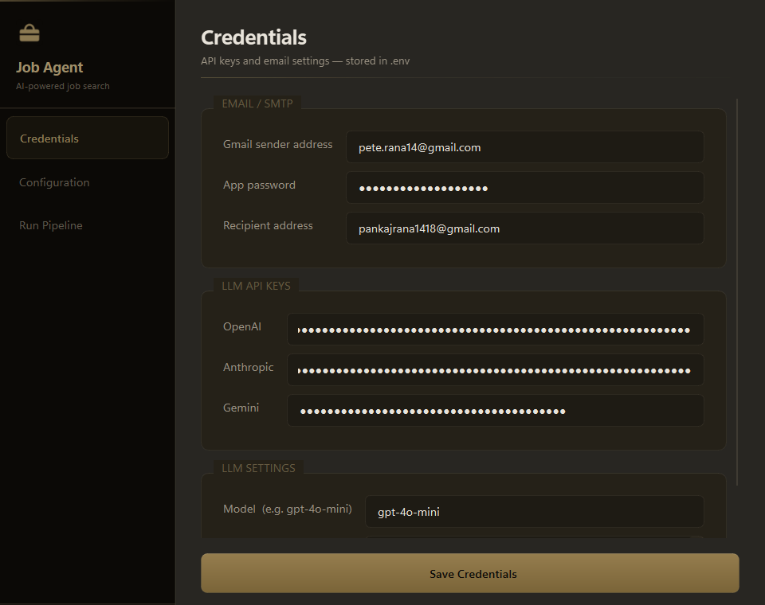
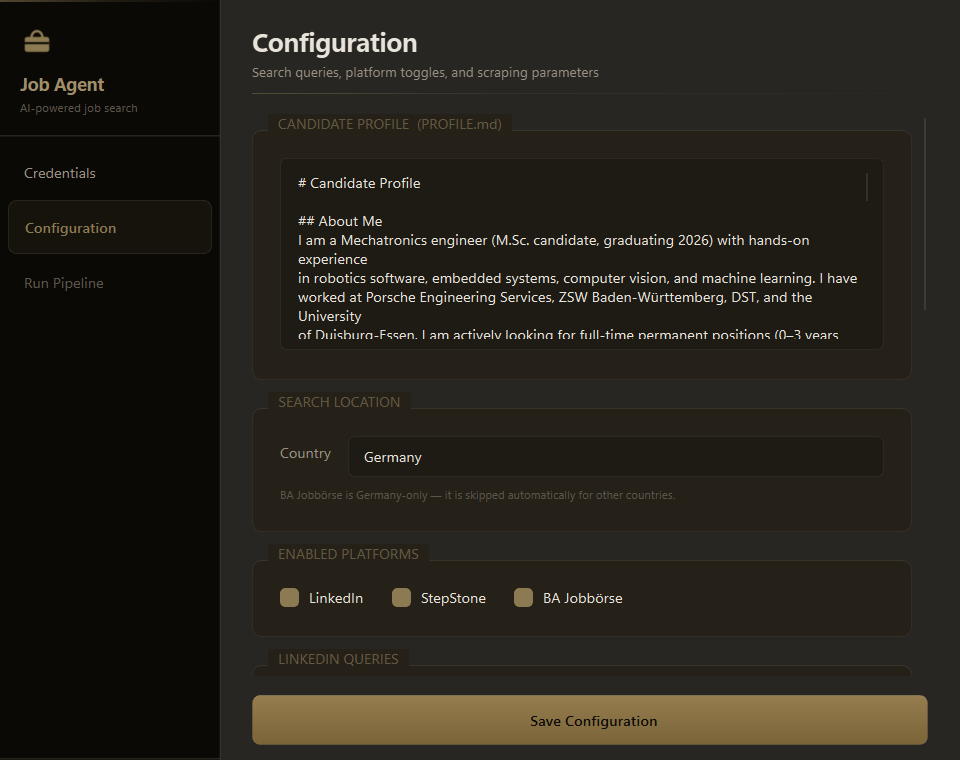
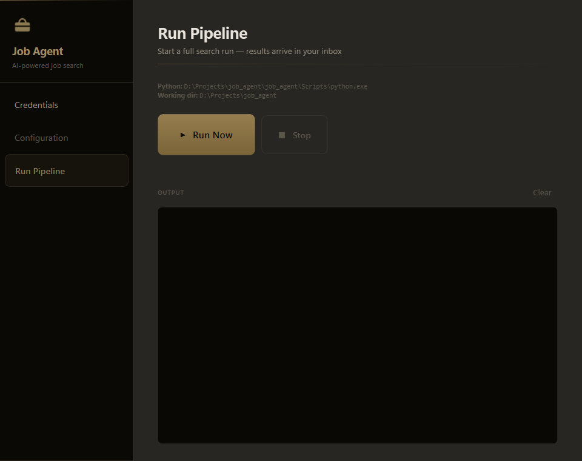

# Job Agent

**AI-powered job-search automation for the German market**

Scrapes LinkedIn, StepStone, and BA Jobbörse, evaluates every posting against
your candidate profile using an LLM, deduplicates results, and delivers a
structured digest email — all configurable through a desktop GUI.

<table>
  <tr>
    <td></td>
    <td></td>
    <td></td>
  </tr>
  <tr>
    <td align="center"><sub>Credentials</sub></td>
    <td align="center"><sub>Configuration</sub></td>
    <td align="center"><sub>Run Pipeline</sub></td>
  </tr>
</table>

[](https://python.org)
[](https://doc.qt.io/qtforpython)
[](https://github.com/BerriAI/litellm)
[](https://playwright.dev/python)
[](LICENSE)

---

## How it works

```
LinkedIn ──┐
StepStone ─┼──► Playwright scraper ──► LiteLLM (score 1–10) ──► SHA-256 dedupe ──► Gmail digest
BA Jobbörse┘    headless Chromium       GPT-4o / Claude / Gemini   JSON database     HTML email
```

1. **Scrape** — Playwright navigates each platform headlessly, extracts job cards and detail pages.
2. **Evaluate** — Every job is sent to an LLM with your `PROFILE.md` and scored 1–10 for fit.
3. **Deduplicate** — A SHA-256 hash of `(title, company, location)` prevents re-sending the same job.
4. **Deliver** — Matched jobs above your threshold are bundled into a rich HTML email.

The desktop GUI lets you configure everything without editing files.

---

## Quick start

Requires [uv](https://docs.astral.sh/uv/getting-started/installation/) (modern Python package manager).

```bash
git clone https://github.com/yourusername/job-agent
cd job-agent
uv sync                      # creates venv + installs all dependencies
uv run playwright install chromium
cp .env.example .env         # fill in your credentials
uv run gui.py                # open the desktop GUI
```

Or with plain pip:

```bash
python -m venv .venv && .venv/Scripts/activate
pip install -r requirements.txt
playwright install chromium
```

---

## Tech stack

| Layer | Technology |
|---|---|
| Scraping | [Playwright](https://playwright.dev/python) — headless Chromium |
| AI evaluation | [LiteLLM](https://github.com/BerriAI/litellm) — single interface for GPT-4o, Claude, Gemini |
| Desktop GUI | [PySide6](https://doc.qt.io/qtforpython) — Qt 6 with Windows 11 Acrylic blur |
| Email delivery | Gmail SMTP via Python `smtplib` — HTML + plain-text fallback |
| Persistence | JSON flat-file with SHA-256 job IDs |
| Env management | `python-dotenv` — credentials never hard-coded |

---

## Features

- **Three platforms** — LinkedIn, StepStone.de, and BA Jobbörse (Germany's federal employment agency)
- **AI match scoring** — jobs evaluated against a free-text candidate profile, not keyword lists; model and threshold are configurable
- **Multi-model fallback** — primary model + ordered fallback list (e.g. GPT-4o → Claude Haiku → Gemini Flash) if rate-limited
- **Duplicate prevention** — SHA-256 content hash; the same posting is never emailed twice even across platforms
- **Desktop GUI** — PySide6 app with sidebar navigation, Windows 11 Acrylic glass effect, and live pipeline output
- **Scheduled runs** — integrates with Windows Task Scheduler for twice-daily automated execution
- **Per-scraper isolation** — one platform failing does not abort the others

---

## Project structure

```
job-agent/
├── gui.py                  # PySide6 desktop app — configure and run the pipeline
├── main.py                 # CLI entry point / pipeline orchestrator
├── config.py               # All tunable parameters
├── scraper_linkedin.py     # LinkedIn scraper (Playwright)
├── scraper_stepstone.py    # StepStone.de scraper (Playwright)
├── scraper_ba.py           # BA Jobbörse scraper (REST API)
├── evaluator.py            # LiteLLM-based job scoring
├── email_sender.py         # Gmail SMTP — HTML + plain-text email
├── database.py             # JSON persistence + SHA-256 deduplication
├── utils.py                # Logging, delays, shared helpers
├── PROFILE.md              # Your CV / preferences — edit this for your search
├── .env.example            # Credential template (copy to .env)
├── pyproject.toml          # Dependencies (uv / pip)
└── docs/
    ├── screenshot.png
    ├── screenshot_credentials.png
    └── screenshot_run.png
```

---

## Configuration

### Credentials (`.env`)

```dotenv
GMAIL_USER=you@gmail.com
GMAIL_PASSWORD=xxxx xxxx xxxx xxxx   # Gmail App Password — not your account password
RECIPIENT_EMAIL=you@example.com

OPENAI_API_KEY=sk-...
ANTHROPIC_API_KEY=sk-ant-...
GEMINI_API_KEY=AIza...

LLM_MODEL=gpt-4o-mini
LLM_MATCH_THRESHOLD=6               # Jobs scored below this (1–10) are skipped
```

Generate a Gmail App Password at [myaccount.google.com/apppasswords](https://myaccount.google.com/apppasswords)
(requires 2-Step Verification).

### Candidate profile (`PROFILE.md`)

Edit `PROFILE.md` with your background, skills, and preferences in plain English.
The LLM reads this file verbatim when evaluating each job — the more specific you are,
the better the filtering.

### Scraping parameters (`config.py` or GUI → Configuration tab)

| Parameter | Default | Description |
|---|---|---|
| `MAX_POSTING_AGE_HOURS` | 36 | Ignore jobs older than this |
| `MAX_PAGES_PER_QUERY` | 2 | Result pages scraped per search |
| `MAX_DETAIL_PAGES_PER_QUERY` | 20 | Individual job pages visited per query |
| `MIN_DELAY` / `MAX_DELAY` | 1.5 / 3.5 s | Random delay between requests |

---

## Running the pipeline

**Via GUI** (recommended):
```bash
uv run gui.py          # open GUI → Run Pipeline tab → Run Now
```

**Via CLI:**
```bash
uv run main.py
```

**Automated — Windows Task Scheduler** (twice daily at 08:00 and 18:00):
```powershell
$py = "$PWD\.venv\Scripts\python.exe"
$script = "$PWD\main.py"
schtasks /create /tn "JobAgentAM" /tr "`"$py`" `"$script`"" /sc daily /st 08:00 /f
schtasks /create /tn "JobAgentPM" /tr "`"$py`" `"$script`"" /sc daily /st 18:00 /f
```

---

## How duplicate detection works

Each job produces a SHA-256 hash of `lower(title) + "|" + lower(company) + "|" + lower(location)`.
This ID is stored in `jobs_database.json` after the email is sent.
On every subsequent run the agent checks this ID — so the same posting found on multiple
platforms or across multiple runs is only ever emailed once.

---

## Troubleshooting

| Symptom | Fix |
|---|---|
| `ModuleNotFoundError: playwright` | Run `uv sync` then `uv run playwright install chromium` |
| Gmail authentication failed | Use an App Password, not your account password |
| No jobs found | Check `logs/job_agent.log` for selector errors; platform HTML may have changed |
| LinkedIn returns 0 results | Increase `MIN_DELAY` / `MAX_DELAY`; LinkedIn aggressively detects bots |
| Scheduled task fails silently | Task Scheduler → History; verify the working directory is set correctly |
